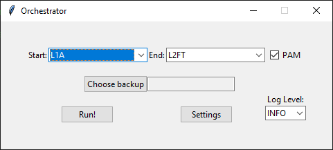
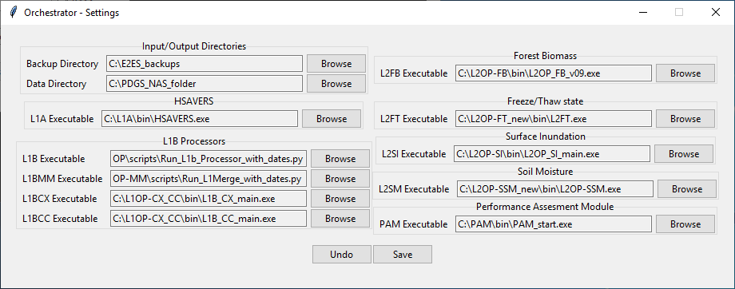
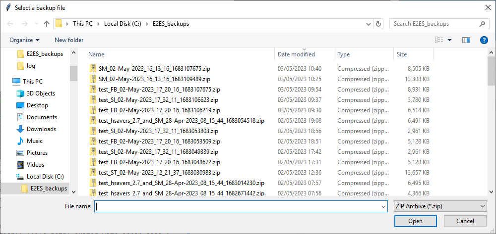

<!-- pandoc README.md -t docx+native_numbering -o out.docx
  https://github.com/jgm/pandoc/issues/7392
  https://opensource.com/article/19/5/convert-markdown-to-word-pandoc (using template)
  TODO: rename this file to USERGUIDE.md
  -->
# E2ES Orchestrator Documentation

## Requirements

The orchestator requires just a standard installation of
[Python 3.10](https://www.python.org/downloads/release/python-3100/) to work. It
can run on both macOS (with limited functionalities needed for testing) and
Windows 10, as well as Windows Server 2019.

## Prerequisites

A storage root folder must be created (e.g., `C:\PDGS_NAS_folder`). This is used
as an I/O directory for each processor. Internal folder structure must mimic ICD
specifications. That is:

  * `PDGS_NAS_Folder`
     * `Auxiliary_Data`
     * `Configuration Files`
     * `DataRelease`
        * `L1A_L1B`
        * `L2PP-FB`
        * `L2PP-FT`
        * `L2PP-SI`
        * `L2PP-SSM`
     * `GNSS-R Mission Planning`
     * `Rinex Data`

Each time one processor is run through the orchestrator, the output will be
stored in the folder with the processor's name. The folder will be overwritten
at each run.

A backup root folder must be created. It is used for storing orchestrator's run
backups (that will not be overwritten and that can be used for later processing)
in zipped files that contain PAM output files also.

Each processor must be installed properly (following processor's release
notes/instructions/readme files) in a folder that can be chosen arbitrarily.
Each processor must also be configured properly.

It is mandatory to test each processor once before use in the orchestration.
The version of the PAM created for the Orchestrator (i.e., the executable named
PAM_start) must be placed in its ‘working directory’ like all other processors.


## Installation

To install the orchestrator it is sufficient to put the orchestrator.py file is
a directory like `script` (like a processor) and to create a directory named
`log` at the same level of the directory that contains the orchestrator itself.

Below there is a sample installation script

```
mkdir C:\Orchestrator
cd C:\Orchestrator
mkdir script log
move <path to orchestrator.py> script
```

## Usage

Assuming you have installed the Python interpreter correctly it is sufficient
to run the `py orchestrator.py` command to launch the orchestrator (of this
command have to be launched from the directory in which `orchestrator.py` is
contained).

Upon the first execution the orchestrator is going to emit two errors because it
did not found the *previous state* file and the configuration file. This is not
a fatal error, since this files will both be created on the first execution of
the orchestrator. The previous state file is just needed to remember the state
of the UI from one execution to another. The configuration file needs to be
edited by pressing the `Settings` button, doing the necessary changes, and the
pressing `Save`, if this button is not pressed the configuration is still going
to be used by the orchestrator but is not going to be saved on the main drive
and therefore is not going to be loaded we you reopen the orchestrator.

You can see the main window and the configuration windows down below.





The `Choose backup` button when pressed opens an `explorer.exe` window that will
let you choose a backup file with a `.zip` extension, like the one below



There is a checkbox to enable or disable the Performance Assesment Module (PAM),
it will be checkable only when the ending processor is L1B or below. Finally
there is a combox to select a log level for each processor (this will be set
only in the processors that accept a comand line argument for selecting the log
level).

Both the previous state file and the configuration file are saved in
`%LOCALAPPDATA%\Tor Vergata\HydroGNSS Orchestrator`.

Once a simulation is started (by pressing the `Run!` button) the
orchestrator's window is going to become unresponsive until the end of the
simulation, you can see the progress of the simulation by looking at the
messages in the console.

## OUTPUTS

At each run, the orchestrator output is stored in dataRoot in the subfolder that
is specific to the processors included by the `Start` and `End` selected. This
output will be overwritten at each run.

At each run, the orchestrator will also save the output in a zip file in the
backupRoot folder. This file is permanent, and it can be used for later
processing.

The name of the zip file is made up of two components according to the following
convention: `[FileName]_[xxxxxxxxxx]`. The first component depends on the name
given by the L1A processor, i.e., `[FileName]` corresponds to
`[RunID_dd-mmm-yyyy_hh_mm_ss]`. The second component is a ten-digit number
created by the orchestrator at each run.

The PAM-related files, i.e, the reference file produced by HSAVERS, are stored
in the above zipped file as well. They are Matlab structures (`.mat`) with the
same name `[FileName]` of the L1A processor output. The outputs of the PAM
modules are stored in a subfolder called `PAM Output`.

The Orchestrator creates a log file named
`[from_startproc_to_endproc]_[xxxxxxxxxx].log` reporting the executed steps and
possible errors encountered during the run `xxxxxxxxxx` that includes all
processing steps from <q>startproc</q> to <q>endproc</q>.

## Troubleshoot

Please make sure that you are using backup files generated by the orchestrator.

If the orchestrator says that it is not able to create or delete some
directories at the start of the execution please try agai a few time. This is a
known problem and we are currently looking for a solution.
